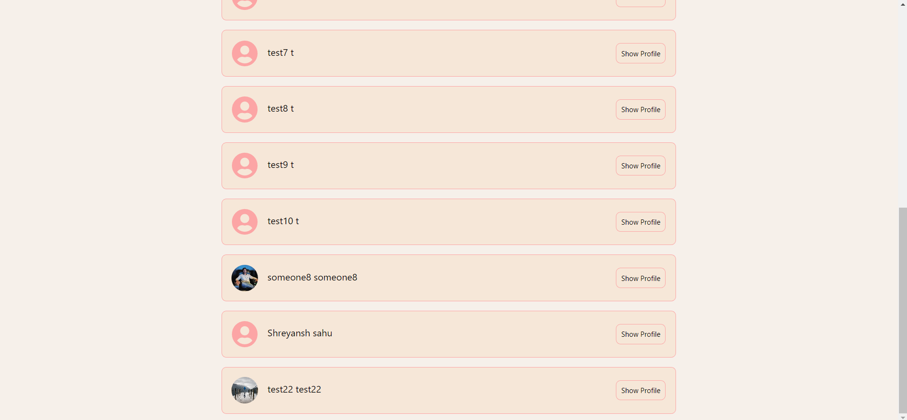

# SociaLize- A Social Media App
This is a social media app where users can create account and posts and follow other people.

## Table of contents

  - [Features](#features)
  - [Screenshot](#screenshot)
  - [Built with](#built-with)
  
### Features
  - SignUp, SignIn Authentication using JWT.
  - User can upload a Profile Picture
  - User can create posts, image and written content or any one of it.
  - Users can view all the posts.
  - Users can like and dislike posts.
  - Users can look for all the other users.
  - Users can look at other profiles and follow or unfollow them.
  
### Screenshots

### Built with

  - ReactJs
  - Redux toolkit 
  - Tallwind Css
  - Node Js and Express Js
 
